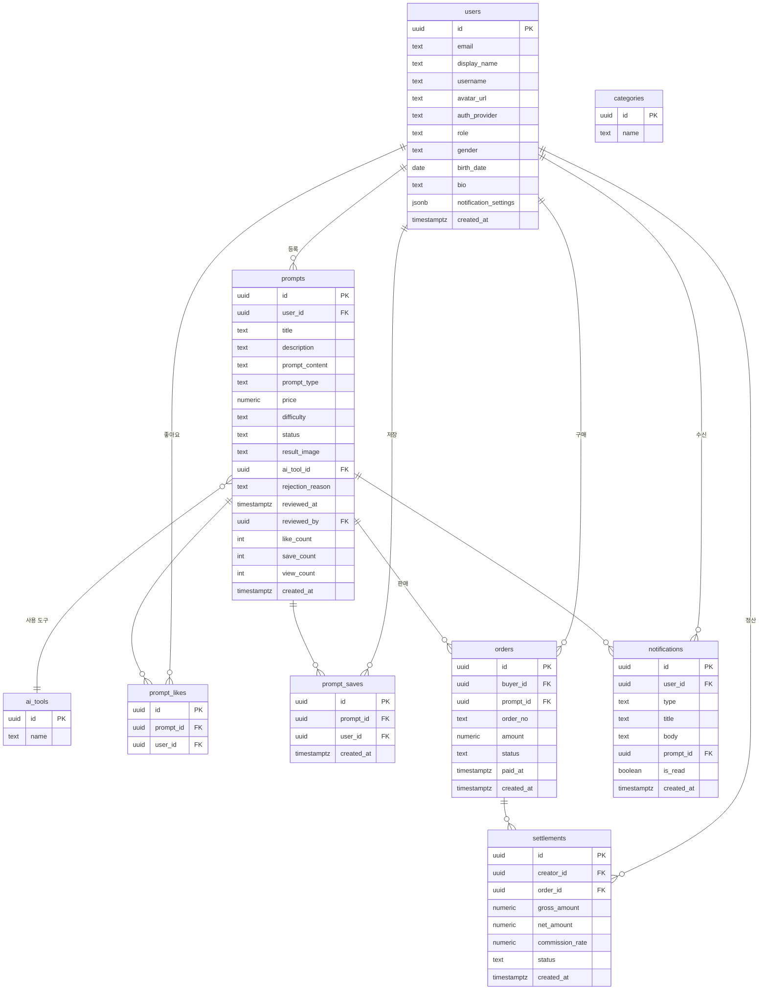

# ALL Creator

> AI 프롬프트 마켓플레이스 — 창작자가 프롬프트를 등록·판매하고, 구매자가 검색·구매하는 플랫폼

---

## 기술 스택

| 분류 | 기술 |
|------|------|
| **프레임워크** | SpiderGen (SPA 기반 JS 프레임워크) |
| **백엔드 / DB** | Supabase (PostgreSQL + Row Level Security) |
| **인증** | Supabase Auth — 이메일/비밀번호, OAuth 2.0 PKCE (Google, Kakao) |
| **스토리지** | Supabase Storage (아바타 이미지, 프롬프트 결과 이미지) |
| **서버리스** | Supabase Edge Functions (결제 승인 처리) |
| **결제** | Toss Payments SDK |
| **스타일** | CSS Variables 기반 다크 테마 |

---

## 주차별 구현 기능

### 1주차 — 프로젝트 기반 구축
- SpiderGen + Supabase 초기 연동
- 프로젝트 디렉토리 구조 설계 (Source / Library / Framework)
- 전역 CSS 변수 기반 다크 테마 디자인 시스템 구축
- `SupabaseManager` 싱글톤 패턴 구현
- `ToastManager`, `ErrorHandler` 글로벌 유틸리티 구현
- SPA 라우팅 (`#/`, `#/auth` 등 해시 기반)

### 2주차 — 인증 / 인가
- 이메일 회원가입 (닉네임·성별·생년월일 포함)
- 이메일 로그인 (자동 로그인 / 이메일 저장 옵션)
- OAuth 2.0 PKCE 소셜 로그인 — Google, Kakao
- 비밀번호 찾기 (이메일 재설정 링크 발송)
- 비밀번호 변경 폼 (링크 클릭 후 세션 기반)
- 소셜 로그인 후 추가 정보 입력 패널 (성별·생년월일 미입력 시)
- `ac_no_persist` + `ac_session_alive` 기반 자동 로그인 미설정 처리

### 3주차 — 메인 화면 & 프롬프트 목록
- `MainView` 공개 랜딩 페이지 (비로그인 접근 가능)
- `NavBar` 컴포넌트 — 검색창, 로그인/유저 영역, 알림 버튼, 드롭다운 메뉴
- `FilterBar` — AI 도구 필터, 가격(무료/유료), 타입(텍스트/이미지), 정렬
- `PromptGrid` — 프롬프트 카드 그리드 (썸네일, 제목, 설명, 가격, 작성자)
- 키워드 검색 (제목·설명 `ilike`)
- 카드 클릭 → 상세 페이지 전환

### 4주차 — 프롬프트 등록 & 상세
- `PromptRegisterView` — 제목·설명·내용·가격·난이도·타입·AI도구·카테고리 입력
- 결과물 이미지 업로드 (Supabase Storage)
- 등록된 프롬프트는 `pending` 상태로 관리자 검수 대기
- 기존 프롬프트 수정 지원 (status → pending 재검수)
- `PromptDetailView` — 배지, 결과 이미지, 작성자, 통계(조회·좋아요·저장)
- 좋아요 / 저장 토글 (RPC 기반)
- 조회수 자동 증가
- 구매 버튼 / 잠금 UI (미구매자)
- 판매자 본인 및 관리자는 구매 없이 프롬프트 전체 내용 열람 가능

### 5주차 — 결제 & 마이페이지
- Toss Payments 연동 — 유료 프롬프트 결제 (성공/취소 리다이렉트 처리)
- Supabase Edge Function 기반 결제 서버 승인
- `settlements` 테이블로 판매자 정산 내역 기록
- `MyPageView` — 프로필 조회·수정, 아바타 업로드
- 내 프롬프트 목록 (상태별: 대기·승인·반려)
- 반려된 프롬프트 사유 확인 및 수정 재등록
- 구매 내역, 저장된 프롬프트, 수익 내역 탭
- 알림 설정 (승인/반려/구매 알림 on/off)
- `NotificationPanel` — 실시간 알림 목록, 읽음 처리

### 6주차 — 관리자 패널 & 안정화
- `AdminView` — 대기·승인·반려 탭 프롬프트 목록
- 승인 버튼 → 확인 모달 → `ps.approve()` + 알림 발송
- 반려 버튼 → 사유 입력 모달 → `ps.reject()` + 알림 발송
- 관리자가 상세 페이지에서 프롬프트 전체 내용 미리보기
- 서브 관리자 지정·해제 (주 관리자 전용)
- Auth 로직 전면 개편:
  - 패턴 매칭 localStorage clear 제거 → 정확한 키 삭제
  - 수동 PKCE exchange 제거 → Supabase `initialize()` 자동 처리
  - `_wasSignedIn` / `_suppressNextSignOut` 이중 플래그 → `_intentionalLogout` 단일 플래그
  - `MainView` / `AuthView` no-persist `signOut()` 호출 제거

---

## 테이블 설계

### users
| 컬럼 | 타입 | 설명 |
|------|------|------|
| id | uuid (PK) | Supabase Auth UID |
| email | text | 이메일 |
| username | text | 고유 사용자명 (내부용) |
| display_name | text | 표시 이름 |
| avatar_url | text | 아바타 이미지 URL |
| auth_provider | text | email / google / kakao |
| role | text | user / sub_admin / main_admin |
| gender | text | male / female / other |
| birth_date | date | 생년월일 |
| bio | text | 자기소개 |
| notification_settings | jsonb | 알림 설정 |
| created_at | timestamptz | 가입일 |

### prompts
| 컬럼 | 타입 | 설명 |
|------|------|------|
| id | uuid (PK) | |
| user_id | uuid (FK → users) | 판매자 |
| title | text | 제목 |
| description | text | 설명 |
| prompt_content | text | 프롬프트 본문 (구매 후 열람) |
| prompt_type | text | text / image |
| price | numeric | 가격 (0 = 무료) |
| difficulty | text | beginner / intermediate / advanced |
| status | text | pending / published / rejected / hidden |
| result_image | text | 결과물 이미지 URL |
| ai_tool_id | uuid (FK → ai_tools) | |
| rejection_reason | text | 반려 사유 |
| reviewed_at | timestamptz | 검수 일시 |
| reviewed_by | uuid (FK → users) | 검수자 |
| like_count | int | 좋아요 수 |
| save_count | int | 저장 수 |
| view_count | int | 조회 수 |
| created_at | timestamptz | |

### ai_tools
| 컬럼 | 타입 | 설명 |
|------|------|------|
| id | uuid (PK) | |
| name | text | ChatGPT, Midjourney 등 |

### categories
| 컬럼 | 타입 | 설명 |
|------|------|------|
| id | uuid (PK) | |
| name | text | 카테고리명 |

### prompt_likes
| 컬럼 | 타입 | 설명 |
|------|------|------|
| id | uuid (PK) | |
| prompt_id | uuid (FK → prompts) | |
| user_id | uuid (FK → users) | |

### prompt_saves
| 컬럼 | 타입 | 설명 |
|------|------|------|
| id | uuid (PK) | |
| prompt_id | uuid (FK → prompts) | |
| user_id | uuid (FK → users) | |
| created_at | timestamptz | |

### orders
| 컬럼 | 타입 | 설명 |
|------|------|------|
| id | uuid (PK) | |
| buyer_id | uuid (FK → users) | 구매자 |
| prompt_id | uuid (FK → prompts) | |
| order_no | text | Toss 주문번호 |
| amount | numeric | 결제 금액 |
| status | text | pending / completed / cancelled |
| paid_at | timestamptz | 결제 완료 일시 |
| created_at | timestamptz | |

### settlements
| 컬럼 | 타입 | 설명 |
|------|------|------|
| id | uuid (PK) | |
| creator_id | uuid (FK → users) | 판매자 |
| order_id | uuid (FK → orders) | |
| gross_amount | numeric | 총 결제액 |
| net_amount | numeric | 정산액 (수수료 차감) |
| commission_rate | numeric | 수수료율 |
| status | text | pending / paid |
| created_at | timestamptz | |

### notifications
| 컬럼 | 타입 | 설명 |
|------|------|------|
| id | uuid (PK) | |
| user_id | uuid (FK → users) | 수신자 |
| type | text | prompt_approved / prompt_rejected / prompt_purchased |
| title | text | 알림 제목 |
| body | text | 알림 내용 |
| prompt_id | uuid (FK → prompts) | 연관 프롬프트 |
| is_read | boolean | 읽음 여부 |
| created_at | timestamptz | |

---

## DB 모델링

---

## 추후 고도화 기능

### 서비스 기능
- **프롬프트 리뷰 시스템** — 구매자가 별점·리뷰를 작성하고 판매자가 답변
- **팔로우 / 팔로워** — 창작자 팔로우, 팔로우한 창작자 신작 피드
- **프롬프트 번들 상품** — 여러 프롬프트를 묶어 할인 판매
- **쿠폰 / 할인 코드** — 프로모션용 할인 쿠폰 발급 및 적용
- **정기 구독 플랜** — 월정액 구독으로 특정 카테고리 무제한 이용
- **프롬프트 버전 관리** — 판매자가 프롬프트 내용을 버전별로 업데이트

### 운영 기능
- **정산 자동화** — 월 단위 정산 금액 자동 계산 및 지급 처리
- **통계 대시보드** — 관리자용 매출·가입자·인기 프롬프트 실시간 현황
- **신고 시스템** — 부적절한 프롬프트 신고 및 관리자 처리 플로우
- **검색 고도화** — Supabase `pg_trgm` 기반 유사도 검색, 태그 기반 필터

### 기술적 개선
- **이미지 최적화** — Supabase Storage + CDN 연동, WebP 변환
- **Supabase Realtime** — 알림 실시간 수신 (현재 폴링 방식)
- **PWA 지원** — 서비스 워커, 오프라인 캐싱, 홈 화면 추가
- **접근성(A11y)** — 키보드 내비게이션, ARIA 레이블 강화
- **E2E 테스트** — 주요 결제·인증 플로우 자동화 테스트
